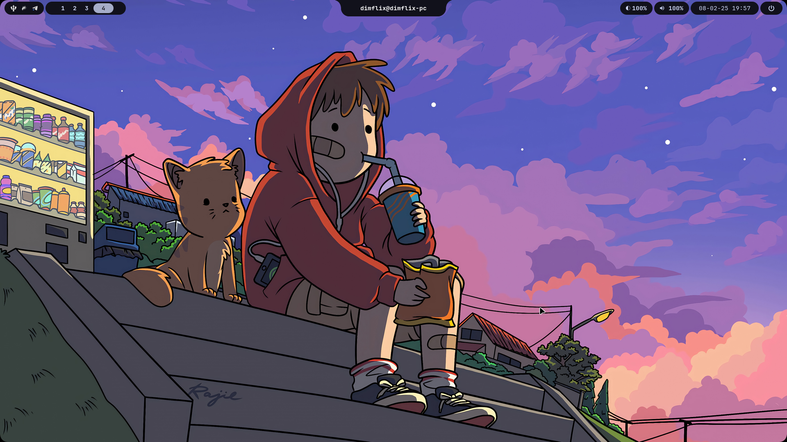
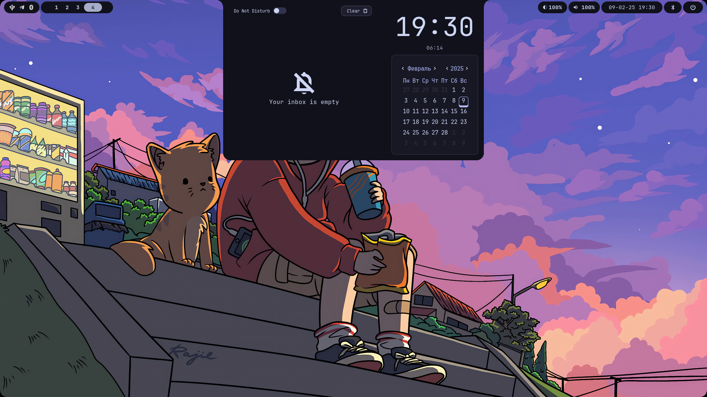
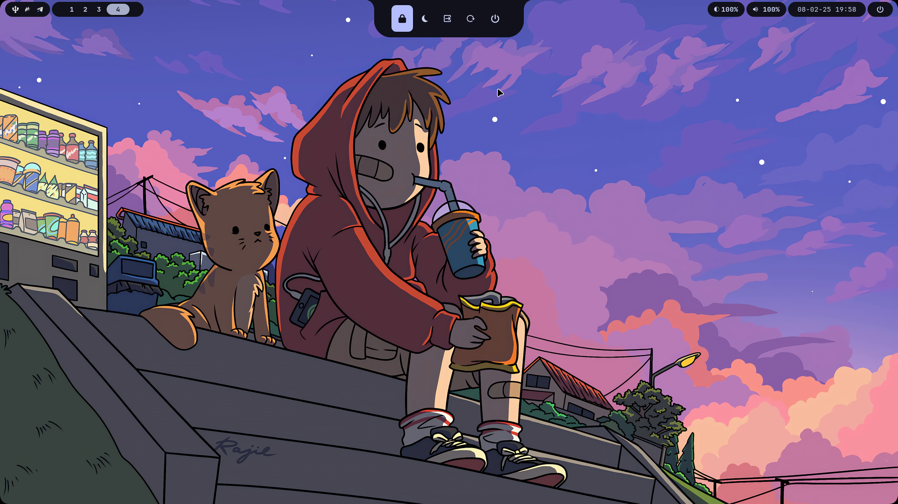
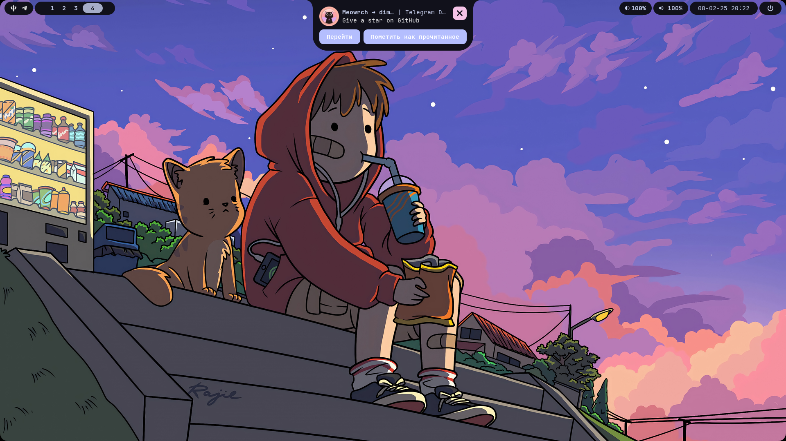

# ✨ MewLine
Элегантный и расширяемый статус-бар для дистрибутива [meowrch](https://github.com/meowrch/meowrch), написанный на Python с использованием фреймворка [Fabric](https://github.com/Fabric-Development/fabric). Сочетает в себе минималистичный дизайн с мощной функциональностью.

> [!Warning]
> Проект находится в активной разработке.
>Некоторые функции могут работать нестабильно


<table align="center">
  <tr>
    <td colspan="4"></td>
  </tr>
  <tr>
    <td colspan="1"></td>
    <td colspan="1"></td>
    <td colspan="1" align="center"></td>
  </tr>
</table>


## 🌟 Особенности
- [X] **Модульная архитектура**
- [X] **Кастомизация** на любой вкус через JSON-конфиг
- [X] Поддержка **тем**
- [X] Полная интеграция с дистрибутивом [meowrch](https://github.com/meowrch/meowrch)
- [X] Анимированные переходы и эффекты
- [X] Низкое потребление ресурсов
- [X] Управление с клавиатуры

## 🧩 Установка зависимостей
```bash
sudo pacman -S dart-sass tesseract tesseract-data-eng tesseract-data-rus slurp grim cliphist
yay -S gnome-bluetooth-3.0 gray-git fabric-cli-git
```

## ⚡ Быстрый старт
```bash
# Установите пакет
yay -S mewline-git

# Сгенерируйте конфиг по умолчанию
mewline --generate-default-config

# Сгенерируйте сочетания клавиш для hyprland
mewline --create-keybindings

# Настройте config.json под свои нужды
micro ~/.config/mewline/config.json

# Запустите MewLine
mewline
```

## 🛠 Для разработчиков
```bash
# Склонируйте репозиторий
git clone https://github.com/meowrch/mewline && cd mewline

# Установите пакетный менеджер
pip install uv # Или sudo pacman -S uv

# Установите зависимости
uv sync

# Сгенерируйте конфиг по умолчанию
uv run generate_default_config

# Сгенерируйте сочетания клавиш для hyprland
uv run create_keybindings

# Настройте config.json под свои нужды
micro ~/.config/mewline/config.json

# Запустите MewLine
uv run mewline
```


## 🎨 Виджеты
### ℹ️ Статус Бар
| Компонент          | Описание                           |
| ------------------ | ---------------------------------- |
| `tray`             | Системный трей                     |
| `workspaces`       | Управление рабочими пространствами |
| `datetime`         | Отображение даты и времени         |
| `brightness`       | Управление яркостью                |
| `volume`           | Управление громкостью звука        |
| `battry`           | Информация о заряде аккумулятора   |
| `power`            | Кнопка для вызова `power_menu`     |
| `ocr`              | Распознавание текста с скриншота   |

## 🏝 Динамический остров
| Компонент          | Описание                                                  |
| ------------------ | ----------------------------------------------------------|
| `compact`          | Отображает информацию о активном окне и включенной музыке |
| `notifications`    | Уведомления                                               |
| `power_menu`       | Меню для управления питанием                              |
| `date_notification`| Меню с календарем и историей уведомлений                  |
| `bluetooth`        | Меню для управления bluetooth                             |
| `app_launcher`     | Лаунчер приложений                                        |
| `wallpapers`       | Выбор обоев                                               |
| `emoji`            | Выбор emoji                                               |

## ❓ Другое
| Компонент          | Описание                                             |
| ------------------ | -----------------------------------------------------|
| `osd`              | Уведомления о событиях изменения громкости/яркости   |


## ⌨️ Сочетания клавиш
Динамическим островом можно управлять с помощью сочетаний клавиш.
Если вы еще не сгенерировали конфигурацию для hyprland, то выполните:
```bash
mewline --create-keybindings
```

| Сочетание клавиш   | Описание                                 |
| ------------------ | -----------------------------------------|
| `Super+Alt+P`      | Меню для управления питанием             |
| `Super+Alt+D`      | Меню с календарем и историей уведомлений |
| `Super+Alt+B`      | Меню для управления bluetooth            |
| `Super+Alt+A`      | Лаунчер приложений                       |
| `Super+Alt+W`      | Выбор обоев                              |
| `Super+Alt+.`      | Выбор emoji                              |

## 🐾 Особые Благодарности
Проект вдохновлён и использует лучшие идеи из:

- **[HyDePanel](https://github.com/rubiin/HyDePanel)** \
    Архитектура модульной системы, некоторые стили и виджеты.

- **[Ax-Shell](https://github.com/Axenide/Ax-Shell)** \
    Подход к обработке системных событий, IPC-механизмы, некоторые стили и виджеты.

Мы глубоко признательны авторам этих проектов за их вклад в open-source сообщество.
Отдельные компоненты были адаптированы и улучшены для интеграции с MewLine.

## 🚀 Развитие проекта
Хотите добавить новый виджет или улучшить существующий?

1. Форкните репозиторий
2. Создайте ветку с фичей: `git checkout -b feature/amazing-widget`
3. Залейте изменения: `git push origin feature/amazing-widget`
4. Откройте Pull Request

Рекомендуем сначала обсудить идею в Issues.

## ☕ Поддержать проект
Если вам нравится MewLine, вы можете помочь его развитию:
| Криптовалюта | Адрес                                              |
| ------------ | -------------------------------------------------- |
| **TON**      | `UQCsIhKtqCnh0Mp76X_5qfh66TPBoBsYx_FihgInw-Auk5BA` |
| **Ethereum** | `0x56e8bf8Ec07b6F2d6aEdA7Bd8814DB5A72164b13`       |
| **Bitcoin**  | `bc1qt5urnw7esunf0v7e9az0jhatxrdd0smem98gdn`       |
| **Tron**     | `TBTZ5RRMfGQQ8Vpf8i5N8DZhNxSum2rzAs`               |


Ваша поддержка мотивирует нас делать больше крутых фич! ❤️

## 📊 Статистика
[](https://star-history.com/#meowrch/mewline&Date)
